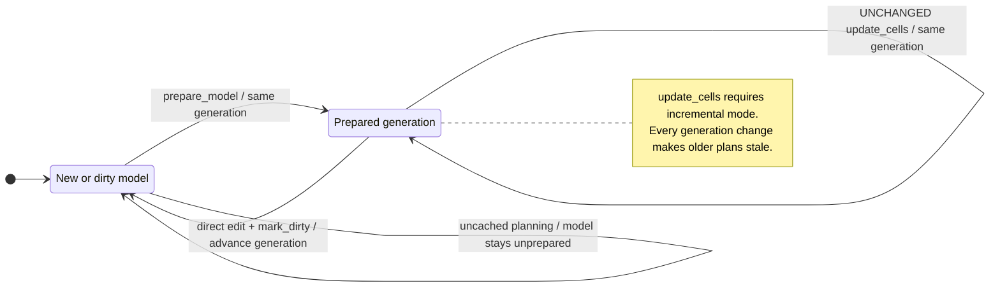
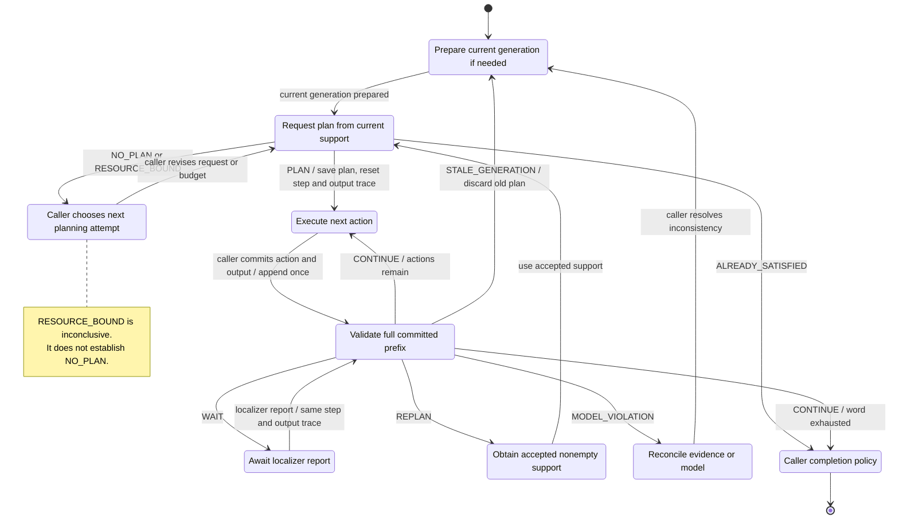

# sync-kgraph

`sync-kgraph` exposes synchronize-or-reveal algorithms as a C23 library and a
native Memgraph query module. A manually mapped graph view represents a
deterministic Mealy automaton. The module can then:

- find a word that brings every current hypothesis to one state;
- find a homing word whose outputs distinguish the current hypothesis;
- explain predicted states and output branches after each action;
- validate localization and committed output traces, detecting stale plans; and
- maintain prepared planning data after transition or observation changes.

Cypher is used only for schema, mapping, and queries. The mapping is manual so
the database owner controls how application entities, actions, and observations
become an automaton.

## Choose A Planning Mode

| Need | API | Preparation | Intended use |
| --- | --- | --- | --- |
| Repeated low-latency plans | `plan_sync`, `plan_disambiguate` | `prepare_model(..., false, false)` | Read-mostly models |
| Frequent small model changes | Cached planners plus `update_cells` | `prepare_model(..., false, true)` | Incrementally maintained models |
| A baseline or one-off plan | `plan_sync_uncached`, `plan_disambiguate_uncached` | None | Rebuilds from the base view on every call |
| Inspect pair transitions in Memgraph Lab | Any cached mode | Set `materialize_pair_edges` to `true` | Visualization only; it does not accelerate planning |

Cached and uncached planners return the same semantic result for the same model
generation. The cached path is optimized for repeated calls; the uncached path
is intentionally retained for controlled comparisons and simple one-off use.

## Build And Install

Build the native module against the C header installed with the target Memgraph
server. Using the server's own header avoids C API version mismatches:

```sh
CC=clang meson setup build-memgraph \
  -Dmemgraph=enabled \
  -Dmemgraph_include_dir=/usr/include/memgraph
meson compile -C build-memgraph
```

The Linux artifact is `build-memgraph/sync.so`; macOS produces the native
shared-module equivalent. Place it in the server's query-module directory, or
install it with Meson, and load it:

```cypher
CALL mg.load("sync");
CALL mg.procedures() YIELD name
WITH name
WHERE name STARTS WITH "sync."
RETURN name ORDER BY name;
```

Expected procedure names:

```text
sync.explain_plan
sync.mark_dirty
sync.plan_disambiguate
sync.plan_disambiguate_uncached
sync.plan_sync
sync.plan_sync_uncached
sync.prepare_model
sync.update_cells
sync.validate_observed_update
sync.validate_update
```

Prebuilt releases contain Linux x86_64 and native macOS arm64 binaries, the C
header and static library, Cypher scripts, the warehouse example, and the
Memgraph Lab view.

## Map A Model

Run `cypher/install_schema.cypher` once. The application schema is otherwise
untouched. Create dedicated view nodes and relationships for each model:

```cypher
(:SyncModel {model, generation, dirty})
(:SyncState {
  model, state_key, state_id?, semantic_ref?, orientation?
})
(:SyncAction {
  model, action_key, action_id?
})
(:SyncOutput {
  model, output_key, output_id?
})
(:SyncState)-[:SYNC_TRANS {
  model, action_key
}]->(:SyncState)
(:SyncState)-[:SYNC_OBS {
  model, action_key
}]->(:SyncOutput)
```

Keys must be unique within their domain and model. For every state/action pair,
there must be exactly one `SYNC_TRANS` and one `SYNC_OBS`. An observation is the
output emitted for the source state and selected action. Optional numeric IDs
only control stable ordering; keys are the public interface.

`prepared_generation`, `oracle_epoch`, `incremental`,
`pair_edges_materialized`, and `snapshot_token` are managed by the module. The
application should not write them directly.

The mapping is deliberately manual because only the database owner knows how
application entities, orientations, commands, and sensor abstractions form the
automaton. Prefer separate `SyncState` nodes linked by `semantic_ref` or an
application-owned relationship instead of adding `SyncState` to application
nodes. The supplied uninstall script deletes nodes in the Sync-KGraph
namespace.

`prepare_model` validates the complete Mealy model and creates the derived pair
records used by cached planning. `PAIR_NEXT` and `PAIR_PRE` are optional
inspection relationships; planning never requires them.

The trigger file is a template, not a generic installed trigger. Adapt its
predicate to the application labels and relationships that feed each model. A
schema-agnostic trigger cannot identify the affected model safely. Exclude
writes made by `update_cells` because that procedure handles generation and
repair atomically.

## API Lifecycle

Model preparation and execution progress are separate. Preparation belongs to
a model generation; the caller retains execution progress for each plan.

| Model state or change | Available API and next step |
| --- | --- |
| New or dirty view | Uncached planners can read the current view. Call `prepare_model` before using cached planners, `explain_plan`, or either monitor with the current generation. |
| Clean prepared view | Plan, explain, and monitor against that generation. Enable `incremental` during preparation to use `update_cells`. |
| Effective `update_cells` batch | The generation advances and prepared records are updated atomically. Plan again using the new generation; no additional preparation is required. |
| `update_cells` returns `UNCHANGED` | The generation stays the same; existing plans remain current. |
| Direct edits to the mapped view | Mark the model dirty and advance its generation as part of the edit, using `mark_dirty` or an adapted trigger, then prepare it again. |
| Plan generation differs from the model | Either monitor returns `STALE_GENERATION`, including while the model is dirty. Prepare if needed and obtain a new plan. |



`prepare_model` rebuilds derived records at the current generation; it does not
advance the model generation. An uncached plan does not prepare the model for
later monitor calls. Module restarts and cache eviction cause hydration on the
next cached planning call without changing the model generation.

Use the following execution lifecycle:

1. Request a plan and inspect its `outcome`. Execute a word only for `PLAN`.
   `ALREADY_SATISFIED` requires no actions; `NO_PLAN` and `RESOURCE_BOUND` do
   not supply a guaranteed plan, even if the returned word is nonempty.
2. Save the plan's `generation`, original `hypotheses`, and full `word` together.
   Start with `completed_steps = 0` and `observed_outputs = []`.
3. Once the caller commits the next action/output event, append that output and
   increment `completed_steps` once. Call `validate_observed_update` with the
   saved original support and the entire committed output prefix. Choose
   `validate_update` when only motion consistency is required.
4. Handle the monitor's decision using the table below. A later localizer
   report for the same completed prefix reuses the same step count and output
   list; it does not append another observation.
5. Whenever a new plan is adopted, save its own original support, word, and
   generation, and reset the step count and output list. A localization change
   alone does not change the model generation or require preparation.

The following states belong to the caller's execution cycle. Transitions out
of validation are labeled with the observation-aware monitor's decisions;
the library returns those decisions without driving the controller.



This diagram shows execution through the prepared Memgraph monitor API.
Uncached planning remains available before preparation. `CONTINUE` at the end
of a word confirms consistency; the caller determines whether its objective is
complete. The caller may also choose to replan when compatible observations
reduce its support.

| Monitor decision | Caller handling |
| --- | --- |
| `CONTINUE` | The supplied evidence matches the prediction. Continue with the remaining word, or replan from the support identified by accepted observations. At the end of the word, apply the caller's completion policy. |
| `WAIT` | Expected hypotheses are available, but no localizer evidence was checked. Supply a localizer report for the same prefix when available. |
| `REPLAN` | Replan from the accepted reported support. If that support is empty, obtain a nonempty support before calling a planner. |
| `MODEL_VIOLATION` | Resolve the inconsistent observation, localization, or model before relying on the plan again. Inspect the separate observation and support diagnostics. |
| `STALE_GENERATION` | Obtain a plan for the current model generation and reset its execution progress. Changing the generation attached to the old word does not revalidate that plan. |

Both monitors are stateless: calling them does not commit execution, update the
model, replace a plan, or remember a previous localizer report. The caller owns
action-completion, sampling, and replanning policy. See
[Runtime Monitoring](#runtime-monitoring) for the exact decision rules.

## Procedure API

### Prepared Planning

```cypher
CALL sync.prepare_model(
  model, materialize_pair_edges = false, incremental = false)
CALL sync.plan_sync(model, hypotheses, budget)
CALL sync.plan_disambiguate(model, hypotheses, bound, budget)
```

The cached planners require a clean prepared model. They are the normal choice
when the same model will be queried repeatedly. The first call after a module
restart or cache eviction reports `cache_state: "HYDRATED"`; subsequent calls
normally report `"HOT"`.

The preparation options are independent:

| `materialize_pair_edges` | `incremental` | Behavior |
| --- | --- | --- |
| `false` | `false` | Prepared planning with compact pair records |
| `true` | `false` | Also create `PAIR_NEXT` and `PAIR_PRE` for inspection |
| `false` | `true` | Compact pair records maintained by `update_cells` |
| `true` | `true` | Incremental maintenance plus inspection relationships |

The process cache defaults to 512 MiB. Set `SYNC_KGRAPH_CACHE_MAX_BYTES` to a
decimal byte limit, or `0` to disable retention. Durable pair records remain
available when retention is disabled.

### Incremental Updates

```cypher
CALL sync.prepare_model(model, false, true)
CALL sync.update_cells(model, changes, repair_budget = 0)
```

Each change is a map containing `state_key`, `action_key`, and at least one of
`target_key` or `output_key`. The complete nonempty batch is validated before
anything is written. Duplicate cells and unknown keys are rejected. A batch
containing only current values returns `UNCHANGED` without advancing the model
generation.

Updates change the base view and its prepared records in one transaction.
Incremental mode is optimized for small batches; if the affected region grows
too large, it falls back to an exact full rebuild. Optional `PAIR_NEXT` and
`PAIR_PRE` relationships are updated only when materialization was enabled.

`repair_budget = 0` uses `ceil(pair_count / 4)`. A positive value is an explicit
touch budget. If repair exceeds it, the procedure rebuilds all pair records and
returns `fallback_rebuild: true`. Passing `-1` requests a full rebuild directly;
this is intended for controlled comparisons, not normal operation.

The result reports `maintenance_mode` (`UNCHANGED`, `INCREMENTAL`, or
`FULL_REBUILD`), direct pair deltas, records touched/examined/written, pair edges
examined, database write batches, invalidations, fallback use, and elapsed time.

### Uncached Planning

```cypher
CALL sync.plan_sync_uncached(model, hypotheses, budget)
CALL sync.plan_disambiguate_uncached(model, hypotheses, bound, budget)
```

The uncached planners validate the current base Mealy view and rebuild the pair
oracle in temporary C memory on every call. They work on dirty or unprepared
models and do not create or modify auxiliary records. Use them for a one-off
plan or as a cache-free reference; prepared planning is optimized for repeated
calls.

For the same generation, hypotheses, bound, and budget, cached and uncached
semantic fields are identical.

All four planner procedures additionally return:

| Field | Cached value | Uncached value | Meaning |
| --- | --- | --- | --- |
| `oracle_source` | `PERSISTED` | `RECOMPUTED` | Source of pair witnesses |
| `oracle_builds` | `0` | `1` | Calls to the full oracle builder |
| `cache_state` | `HOT` or `HYDRATED` | `BYPASSED` | Process snapshot state |
| `oracle_rows_loaded` | `0` hot; all pairs hydrated | `0` | Durable rows loaded this call |
| `oracle_load_batches` | `0` hot; hydration batches | `0` | Pair-record queries |
| `oracle_cache_hits` | Snapshot reads | `0` | Witness reads served in C |
| `snapshot_record_reads` | Requested witnesses | `0` | Pair records read by the planner |
| `snapshot_hydration_time_us` | Hydration time or `0` | `0` | Cold snapshot reconstruction |
| `oracle_time_us` | Hydration time or `0` | Rebuild time | Oracle preparation work |
| `total_compute_time_us` | Variable | Variable | Base-view extraction through planner completion |

`planning_time_us` covers only the word planner. `total_compute_time_us` covers
model extraction through planner completion, excluding result encoding, Bolt
transport, and client latency.

After upgrading from a release whose pair records lack `oracle_epoch`, run
`prepare_model` again.

### Supporting API

```cypher
CALL sync.explain_plan(model, generation, hypotheses, word)
CALL sync.validate_update(
  model, generation, hypotheses, word, completed_steps,
  reported_hypotheses, localizer_available = true)
CALL sync.validate_observed_update(
  model, generation, hypotheses, word, completed_steps,
  observed_outputs, reported_hypotheses, localizer_available = true)
CALL sync.mark_dirty(model)
```

`hypotheses`, `reported_hypotheses`, and returned supports are lists of
`state_key` strings. Words are lists of `action_key` strings. `budget` limits
search expansions; `bound` is the required worst-case output-branch support
size. A bound of one requests a homing word.

For a support of `n` distinct states, the recommended caller policy is to try
`bound = 1` first. Only after `NO_PLAN`, and when `n > 1`, try `bound = n - 1`
for the weakest nontrivial guaranteed reduction. For `n = 2` these bounds are
identical, so no retry is needed. Feasibility is monotone in the bound:
`NO_PLAN` at `n - 1` rules out every stricter reduction bound. Testing each
intermediate bound repeats searches for weaker objectives. `RESOURCE_BOUND`
means the search was inconclusive and must not be treated as `NO_PLAN`.
Execute until accepted information changes the support, then replan from that
support. The planner always honors the requested bound; it does not perform
this fallback automatically.

Planner calls return an `outcome` of `PLAN`, `ALREADY_SATISFIED`, `NO_PLAN`, or
`RESOURCE_BOUND`, and a `method` of `PAIR_MERGE`, `PAIR_RESOLUTION`,
`PARTITION_BFS`, or `NONE`. Explanation and monitoring retain the prepared-model
lifecycle even when a word was obtained through the uncached API.

The public C API is in `include/sync_kgraph/sync.h`. It exposes the same
automaton builder, pair oracle, planners, explanation visitor, and monitor
without requiring Memgraph.

### Runtime Monitoring

`validate_update` is the motion-only consistency monitor. It compares the
localizer report with `delta(H, prefix)`, without checking any sensor outputs.
Its existing procedure signature and C result type are unchanged.

`validate_observed_update` is the Mealy observation-aware consistency monitor.
On every call, provide the original plan support `H`, its generation and word,
and the full committed output prefix. `observed_outputs` contains public
`output_key` strings, one per completed action, in order. Unknown output keys,
invalid actions or states, and a length different from `completed_steps` are
argument errors. Stale plans return `STALE_GENERATION` before resolving keys
against the changed model, as with the motion-only procedure.

Starting from `S = H`, each committed action `a` and output `o` updates:

```text
S := { delta(q, a) | q in S and eta(q, a) = o }
```

Outputs are evaluated on the source state and action, using the same Mealy
convention as the disambiguation planner. Equal successor states are collapsed.
The resulting support `E` includes only hypotheses compatible with the entire
output prefix.

| Condition | Decision | Returned expected support |
| --- | --- | --- |
| Generation differs from the model | `STALE_GENERATION` | `[]`; no observation check |
| An output is impossible from every surviving hypothesis | `MODEL_VIOLATION` | `[]`, even if localization is unavailable |
| Outputs are compatible and localization is unavailable | `WAIT` | `E` |
| Localizer report equals `E` | `CONTINUE` | `E` |
| Localizer report is a strict subset of `E` | `REPLAN` | `E` |
| Localizer report includes a state outside `E` | `MODEL_VIOLATION` | `E` |

Pass `reported_hypotheses = []` and `localizer_available = false` when the
localizer is unavailable; its report is ignored. An explicitly available but
empty report is a strict subset and returns `REPLAN` if the outputs are
compatible. The original motion-only monitor still requires a nonempty report
when localization is available.

The new procedure returns the existing `status`, `decision`, `reason`,
`expected_hypotheses`, `unexpected_hypotheses`, and `generation` fields, plus:

| Field | Meaning |
| --- | --- |
| `observation_compatible` | `true` for a possible trace, `false` for an impossible trace, `null` for a stale plan |
| `failed_observation_step` | First incompatible step, numbered from 1; otherwise `null` |
| `observed_output` | Offending output key; otherwise `null` |
| `expected_outputs` | Distinct possible output keys at the failing step, conditioned on earlier outputs; otherwise `[]` |

`unexpected_hypotheses` always means reported states outside `E`, and is empty
when localization is unavailable. Observation mismatches use the separate
diagnostic fields. When `E` is empty, all reported states are unexpected.

The C equivalent is `sg_validate_observed_update`, which takes numeric output
IDs and returns `sg_observed_monitor_result`. Common fields are in its
`monitor` member; absent diagnostic indices use `SG_INDEX_NONE`. The
`observation_compatible` flag is unevaluated for a stale plan. Release the
result with `sg_observed_monitor_result_free` before reuse. The C API validates
only consumed action IDs; the Memgraph adapter resolves the whole supplied word.

In C, monitoring requires a validated `sg_automaton` but no pair oracle or
Memgraph preparation. Inputs are borrowed for the duration of the call; the
result owns its returned arrays. Keep a plan result alive while using its
`word`, and call `sg_plan_result_free` when replacing or retiring that plan.
Check the returned `sg_status` before reading a monitor result: `SG_OK` means
validation completed, and can accompany `MODEL_VIOLATION` or `STALE_GENERATION`.
Likewise, a Memgraph row with `status = "OK"` still requires inspecting
`decision`.

The caller owns physical action-completion and sampling policy. Commit an
action/output event before submitting it to the monitor. Localization cannot
override an impossible committed output, even if its reported support matches
the motion-only prediction. Timing, action continuation, goal selection, and
responding to `REPLAN` remain caller responsibilities.

## Worked Warehouse Example

The example maps two ambiguous bays, two corridor poses, and one dock pose.
Execute the queries below in order, starting from the reset/load step. The
[numbered Cypher files](examples/warehouse/README.md) provide a shorter runnable
walkthrough; their comments give the expected generations for that sequence.

### 1. Install The Schema

```sh
mgconsole < cypher/install_schema.cypher
```

Expected: ten indexes are created and no data rows are returned. Reuse these
indexes for every mapped model.

### 2. Load The Manual View

```sh
mgconsole < examples/warehouse/00_reset_and_load.cypher
```

Verify the mapping:

```cypher
MATCH (m:SyncModel {model: "warehouse"})
OPTIONAL MATCH (s:SyncState {model: "warehouse"})
WITH m, count(s) AS states
OPTIONAL MATCH (a:SyncAction {model: "warehouse"})
WITH m, states, count(a) AS actions
OPTIONAL MATCH (o:SyncOutput {model: "warehouse"})
RETURN m.generation AS generation, m.dirty AS dirty,
       states, actions, count(o) AS outputs;
```

Expected:

```text
generation: 1, dirty: true, states: 5, actions: 4, outputs: 4
```

The view contains 20 transitions and 20 observations, one of each per
state/action cell.

### 3. Plan Without The Cache

The freshly loaded model is dirty and has no auxiliary records. Compute a
synchronizing word directly from the base view:

```cypher
CALL sync.plan_sync_uncached(
  "warehouse", ["west_bay:east", "east_bay:west"], 64)
YIELD status, outcome, method, word, length, final_state_key,
      final_support_size, generation, oracle_source, oracle_builds, cache_state
RETURN status, outcome, method, word, length, final_state_key,
       final_support_size, generation, oracle_source, oracle_builds, cache_state;
```

Expected:

```text
"OK", "PLAN", "PAIR_MERGE", ["to_corridor", "go_west"], 2,
"dock:north", 1, 1, "RECOMPUTED", 1, "BYPASSED"
```

Compute the homing word through the same uncached path:

```cypher
CALL sync.plan_disambiguate_uncached(
  "warehouse", ["west_bay:east", "east_bay:west"], 1, 64)
YIELD status, outcome, method, word, length, best_support_size,
      worst_support_size, branch_count, homing, generation,
      oracle_source, oracle_builds, cache_state
RETURN status, outcome, method, word, length, best_support_size,
       worst_support_size, branch_count, homing, generation,
       oracle_source, oracle_builds, cache_state;
```

Expected:

```text
"OK", "PLAN", "PAIR_RESOLUTION", ["to_corridor"], 1,
1, 1, 2, true, 1, "RECOMPUTED", 1, "BYPASSED"
```

Confirm that neither call materialized auxiliary graph data:

```cypher
OPTIONAL MATCH (p:SyncPair {model: "warehouse"})
WITH count(p) AS pairs
OPTIONAL MATCH ()-[r:PAIR_NEXT|PAIR_PRE {model: "warehouse"}]->()
RETURN pairs, count(r) AS pair_relationships;
```

Expected:

```text
pairs: 0, pair_relationships: 0
```

### 4. Prepare The Cached Model

```cypher
CALL sync.prepare_model("warehouse", true)
YIELD status, generation, oracle_epoch, states, actions, outputs, transitions,
      pairs, pair_edges, mergeable_pairs, resolvable_pairs,
      materialized_pair_edges, incremental_enabled
RETURN status, generation, oracle_epoch, states, actions, outputs, transitions,
       pairs, pair_edges, mergeable_pairs, resolvable_pairs,
       materialized_pair_edges, incremental_enabled;
```

Expected:

```text
"OK", 1, 1, 5, 4, 4, 20, 15, 60, 15, 15, true, false
```

There are 15 unordered state pairs with repetition and 60 pair/action edges.
Because edge materialization was enabled, the graph contains 15 `SyncPair`, 60
`PAIR_NEXT`, and 60 `PAIR_PRE` records.

### 5. Plan Synchronization From Persisted Witnesses

```cypher
CALL sync.plan_sync(
  "warehouse", ["west_bay:east", "east_bay:west"], 64)
YIELD status, outcome, method, word, length, final_state_key,
      final_support_size, generation, oracle_source, oracle_builds, cache_state
RETURN status, outcome, method, word, length, final_state_key,
       final_support_size, generation, oracle_source, oracle_builds, cache_state;
```

Expected:

```text
"OK", "PLAN", "PAIR_MERGE", ["to_corridor", "go_west"], 2,
"dock:north", 1, 1, "PERSISTED", 0, "HOT"
```

The semantic columns exactly match the uncached synchronization result. Only
the oracle metadata and timing fields differ.

### 6. Plan Disambiguation From Persisted Witnesses

```cypher
CALL sync.plan_disambiguate(
  "warehouse", ["west_bay:east", "east_bay:west"], 1, 64)
YIELD status, outcome, method, word, length, best_support_size,
      worst_support_size, branch_count, homing, generation,
      oracle_source, oracle_builds, cache_state
RETURN status, outcome, method, word, length, best_support_size,
       worst_support_size, branch_count, homing, generation,
       oracle_source, oracle_builds, cache_state;
```

Expected:

```text
"OK", "PLAN", "PAIR_RESOLUTION", ["to_corridor"], 1,
1, 1, 2, true, 1, "PERSISTED", 0, "HOT"
```

The two bays emit different landmark outputs under `to_corridor`, so one
action partitions the initial support into two singleton branches. This result
also exactly matches the uncached homing result.

### 7. Explain The Synchronizing Word

```cypher
CALL sync.explain_plan(
  "warehouse", 1,
  ["west_bay:east", "east_bay:west"],
  ["to_corridor", "go_west"])
YIELD step, action, predicted_hypotheses, output_trace, branch_hypotheses
RETURN step, action, predicted_hypotheses, output_trace, branch_hypotheses
ORDER BY step, output_trace[0] DESC;
```

Expected rows:

```text
0, "", [west_bay:east, east_bay:west], [],
   [west_bay:east, east_bay:west]
1, "to_corridor", [corridor_w:east, corridor_e:west],
   [west_landmark], [corridor_w:east]
1, "to_corridor", [corridor_w:east, corridor_e:west],
   [east_landmark], [corridor_e:west]
2, "go_west", [dock:north], [west_landmark, dock], [dock:north]
2, "go_west", [dock:north], [east_landmark, dock], [dock:north]
```

### 8. Monitor Committed Actions And Observations

First, the existing motion-only API checks the localizer after `to_corridor`:

```cypher
CALL sync.validate_update(
  "warehouse", 1,
  ["west_bay:east", "east_bay:west"],
  ["to_corridor", "go_west"], 1,
  ["corridor_w:east", "corridor_e:west"], true)
YIELD status, decision, expected_hypotheses, unexpected_hypotheses, generation
RETURN status, decision, expected_hypotheses, unexpected_hypotheses, generation;
```

Expected:

```text
"OK", "CONTINUE", [corridor_w:east, corridor_e:west], [], 1
```

Reporting only one expected corridor returns `REPLAN`; reporting `dock:north`
at this step returns `MODEL_VIOLATION`; passing an unavailable localizer returns
`WAIT`.

For the observation-aware API, retain the original plan from step 5. Once
`to_corridor` has committed the output `west_landmark`, validation can proceed
even if the localizer has not supplied a report:

```cypher
CALL sync.validate_observed_update(
  "warehouse", 1,
  ["west_bay:east", "east_bay:west"],
  ["to_corridor", "go_west"], 1, ["west_landmark"], [], false)
YIELD decision, expected_hypotheses, observation_compatible
RETURN decision, expected_hypotheses, observation_compatible;
```

Expected: `WAIT`, `[corridor_w:east]`, `true`.
When localization becomes available for that same completed action, submit
the same step count and output prefix:

```cypher
CALL sync.validate_observed_update(
  "warehouse", 1,
  ["west_bay:east", "east_bay:west"],
  ["to_corridor", "go_west"], 1, ["west_landmark"],
  ["corridor_w:east"], true)
YIELD decision, expected_hypotheses, observation_compatible,
      failed_observation_step, observed_output, expected_outputs
RETURN decision, expected_hypotheses, observation_compatible,
       failed_observation_step, observed_output, expected_outputs;
```

Expected: `CONTINUE`, `[corridor_w:east]`, `true`, `null`, `null`, `[]`.
Reporting `corridor_e:west` instead would return `MODEL_VIOLATION`, although
that state belongs to the motion-only prediction.

After the second action, `go_west`, commits output `dock`, replay both outputs
from the original bays:

```cypher
CALL sync.validate_observed_update(
  "warehouse", 1,
  ["west_bay:east", "east_bay:west"],
  ["to_corridor", "go_west"], 2, ["west_landmark", "dock"],
  ["dock:north"], true)
YIELD decision, expected_hypotheses, observation_compatible
RETURN decision, expected_hypotheses, observation_compatible;
```

Expected: `CONTINUE`, `[dock:north]`, `true`. The word is now exhausted;
`CONTINUE` reports consistency, not a new action to execute.

The next two queries illustrate independent alternative execution histories.
An impossible first output is rejected even when localization exactly matches
the motion-only prediction:

```cypher
CALL sync.validate_observed_update(
  "warehouse", 1,
  ["west_bay:east", "east_bay:west"],
  ["to_corridor", "go_west"], 1, ["symmetric"],
  ["corridor_w:east", "corridor_e:west"], true)
YIELD decision, expected_hypotheses, observation_compatible,
      failed_observation_step, observed_output, expected_outputs
RETURN decision, expected_hypotheses, observation_compatible,
       failed_observation_step, observed_output, expected_outputs;
```

Expected: `MODEL_VIOLATION`, `[]`, `false`, `1`, `symmetric`,
`[west_landmark, east_landmark]`.

For a strict-subset example, start from both bays and the dock, commit
`go_east` with output `symmetric`, and report only `west_bay:east`. The output
leaves both bays possible, while localization shrinks that support further.
Replan from the accepted report and start the new plan at step zero:

```cypher
CALL sync.validate_observed_update(
  "warehouse", 1, ["west_bay:east", "east_bay:west", "dock:north"],
  ["go_east"], 1, ["symmetric"], ["west_bay:east"], true)
YIELD decision
WITH decision, ["west_bay:east"] AS accepted_hypotheses
WHERE decision = "REPLAN"
CALL sync.plan_disambiguate("warehouse", accepted_hypotheses, 1, 64)
YIELD outcome, word, generation
RETURN decision, accepted_hypotheses, outcome, word, generation;
```

Expected: `REPLAN`, `[west_bay:east]`, `ALREADY_SATISFIED`, `[]`, `1`.
The accepted singleton already satisfies homing, so this example requires no
further disambiguation actions. If replanning returns `PLAN`, monitor its word
with `accepted_hypotheses` as the new original support, `completed_steps = 0`,
and `observed_outputs = []`. Reusing the previous output trace would attach
observations to the wrong word.

### 9. Invalidate Old Plans

```cypher
CALL sync.mark_dirty("warehouse") YIELD status, generation
RETURN status, generation;
```

Expected:

```text
"DIRTY", 2
```

Cached planning is now rejected until
`sync.prepare_model("warehouse", false)` succeeds. Uncached planning remains
available against the current base view and returns generation 2. A monitor
call carrying generation 1 still returns a stale result while the model is
dirty:

```cypher
CALL sync.validate_observed_update(
  "warehouse", 1, ["west_bay:east", "east_bay:west"],
  ["to_corridor", "go_west"], 1, ["west_landmark"], [], false)
YIELD status, decision, generation, observation_compatible
RETURN status, decision, generation, observation_compatible;
```

```text
"OK", "STALE_GENERATION", 2, null
```

Monitoring a generation-2 word requires preparation first. Keep the saved
generation-1 word marked stale; obtain a new plan for generation 2.

### 10. Prepare And Update Incrementally

Prepare the dirty generation in compact incremental mode. This keeps the
derived graph compact and enables `update_cells`:

```cypher
CALL sync.prepare_model("warehouse", false, true)
YIELD status, generation, oracle_epoch, pairs, pair_edges,
      materialized_pair_edges, incremental_enabled
RETURN status, generation, oracle_epoch, pairs, pair_edges,
       materialized_pair_edges, incremental_enabled;
```

Expected:

```text
"OK", 2, 2, 15, 60, false, true
```

Change one observation cell:

```cypher
CALL sync.update_cells("warehouse", [{
  state_key: "east_bay:west",
  action_key: "to_wall",
  output_key: "east_landmark"
}], 15)
YIELD status, maintenance_mode, generation, oracle_epoch, changed_cells,
      direct_pair_edges, fallback_rebuild
RETURN status, maintenance_mode, generation, oracle_epoch, changed_cells,
       direct_pair_edges, fallback_rebuild;
```

Expected:

```text
"UPDATED", "INCREMENTAL", 3, 2, 1, 5, false
```

The five direct deltas are the `to_wall` entries for the five unordered pairs
containing `east_bay:west`. The epoch stays at 2 while generation advances, and
no pair relationships are created. Repeating the same value is a no-op:

```cypher
CALL sync.update_cells("warehouse", [{
  state_key: "east_bay:west",
  action_key: "to_wall",
  output_key: "east_landmark"
}], 15)
YIELD status, generation, oracle_epoch, changed_cells, direct_pair_edges
RETURN status, generation, oracle_epoch, changed_cells, direct_pair_edges;
```

Expected:

```text
"UNCHANGED", 3, 2, 0, 0
```

Cached and uncached homing calls still return `["to_corridor"]` with generation
3. An invalid key aborts the whole batch and leaves generation, base cells, and
the oracle unchanged.

The successful update kept generation 3 prepared. A new plan can therefore be
created and its initial support validated immediately, with an empty output
prefix:

```cypher
WITH ["west_bay:east", "east_bay:west"] AS hypotheses
CALL sync.plan_disambiguate("warehouse", hypotheses, 1, 64)
YIELD outcome, word, generation
WITH hypotheses, word, generation, outcome
WHERE outcome = "PLAN"
CALL sync.validate_observed_update(
  "warehouse", generation, hypotheses, word, 0, [], hypotheses, true)
YIELD decision, expected_hypotheses, observation_compatible
RETURN word, generation, decision, expected_hypotheses, observation_compatible;
```

Expected: `[to_corridor]`, `3`, `CONTINUE`,
`[west_bay:east, east_bay:west]`, `true`. An older plan still produces
`STALE_GENERATION` even when the changed cell was not on its word.

## Developer Documentation

See [HACKING.md](HACKING.md) for the C snapshot architecture, cache and update
lifecycle diagrams, correctness invariants, ablation benchmarks, quality gates,
coverage policy, and release process.
